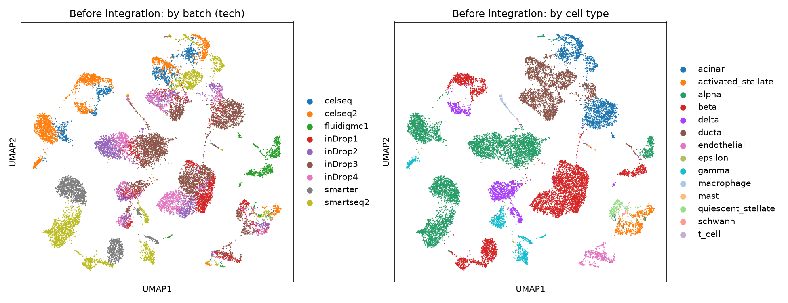
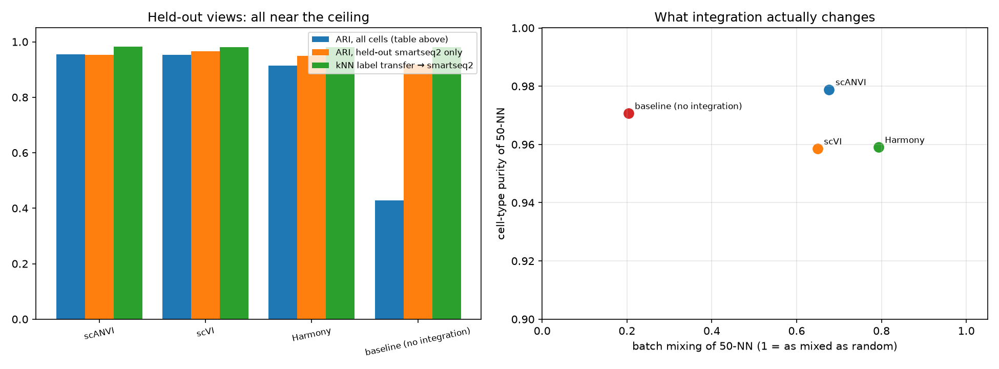
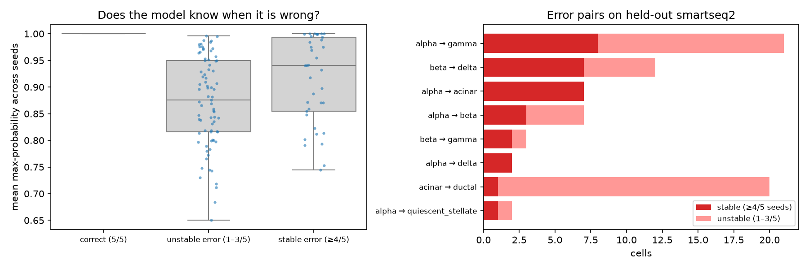
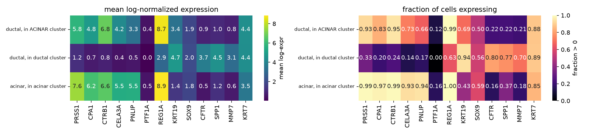

# Single-cell integration on human pancreatic islets — and what its errors are made of

A portfolio project: an end-to-end single-cell integration analysis (Harmony, scVI, scANVI
against a no-integration baseline) on the scIB human pancreas benchmark, built to show that
I can run this kind of analysis independently, evaluate it honestly, and follow up on what
the evaluation turns up. It is transcriptomics (scRNA-seq) on islet tissue, not
metabolomics; the connection to metabolic disease is the tissue and the methods, and the
next step (below) is the disease contrast.

The project went through two passes. The first (`01`–`06`) was a method comparison with a
single number per method. The second (`07`–`08`, plus edits to `03`–`05`) is what a
critical reader of the first pass would have asked for: numbers with error bars, a
comparison that is actually fair to the unsupervised methods, and an error analysis that
tests its claims instead of narrating them. Several of the first pass's conclusions did
not survive; the ones that did are stated below with the evidence.

## What the second pass changed, and why

1. **The README quoted numbers from a run that no longer existed.** All tables below are
   printed by `python src/make_readme_tables.py` from the CSVs in `results/`, so they
   cannot drift from the notebooks again. Every notebook in the repository was executed
   top to bottom, in order, in one environment (`environment.yml`).
2. **scANVI's all-cell ARI was compared with unsupervised methods as if it were one of
   them.** scANVI was trained with the labels of ~85 % of the cells. `05 §4b` adds three
   views on the held-out technology — and the honest answer turned out to be more
   interesting than the fix (Table 3).
3. **No seed, single runs, third-decimal claims.** `03`/`04` now fix seed 0 and report
   macro-F1 next to accuracy; `07` repeats scVI and scANVI five times: mean ± sd, training
   curves, and per-cell predictions per seed (Table 2).
4. **The error analysis was a narrative.** `06` explained the errors biologically without
   looking at a single gene. `08` tracks which cells are mislabelled *consistently* across
   seeds, then tests four competing explanations (annotation, doublet, ambient RNA, genuine
   co-expression) with marker panels, Scrublet, library size and per-technology ambient
   floors. About a third of a single run's "errors" are initialization noise (Table 4).
5. Housekeeping: figures are tracked (the README embeds them), `06` is kept as a record
   with a header saying which of its claims were refuted, and dead code and unused
   dependencies were removed.

## Results

### 1. Integration matters for joint clustering — and the differences between methods are real but small

| Method | Leiden res. | ARI (all cells) | NMI (all cells) | clusters |
|---|---|---|---|---|
| scANVI | 0.3 | 0.955 | 0.932 | 13 |
| scVI | 0.3 | 0.953 | 0.922 | 11 |
| Harmony | 0.3 | 0.914 | 0.888 | 12 |
| baseline (no integration) | 0.3 | 0.428 | 0.708 | 19 |

*Table 1 — single run (seed 0), Leiden clustering of each latent space scored against the
14 annotated cell types, best resolution of a 0.3–1.3 sweep (notebook 05). The optimum
sits at the edge of the sweep for every method; finer resolutions were not explored.*

| Method | seeds | ARI all cells | NMI all cells | held-out accuracy | held-out macro-F1 |
|---|---|---|---|---|---|
| scVI | 5 | 0.946 ± 0.002 | 0.912 ± 0.002 | — | — |
| scANVI | 5 | 0.956 ± 0.004 | 0.933 ± 0.006 | 0.975 ± 0.003 | 0.939 ± 0.014 |

*Table 2 — five seeds, mean ± sd (notebook 07). Harmony is deterministic. Held-out
accuracy and macro-F1 are scANVI's own label transfer to the 2394 `smartseq2` cells whose
labels were hidden during training; macro-F1 is over the 13 cell types present in that
hold-out.*

The jump from no integration to any integration (ARI 0.43 → 0.91+) is the large effect.
The ordering scANVI > scVI > Harmony on all-cell ARI holds in every seed, but for scANVI
this is partly the supervision showing, not the integration. Restricted to the held-out
cells, where neither model saw a label, scANVI is still ahead in every seed, by a smaller
margin: ARI 0.952 ± 0.007 vs 0.943 ± 0.005 (notebook 07). A gap of 0.01 is at the
resolution limit of five seeds and one hold-out technology; an earlier sweep with
scvi-tools 1.4 found the two level. No seed triggered early stopping; the validation ELBO
is flat from about epoch 100, so "200 epochs reached" meant converged, not under-trained
(`results/figures/07_training_curves.png`).

The single seed-0 scVI run in `03` (ARI 0.953) sits about three standard deviations above
the five-seed mean. A fixed seed makes a notebook repeatable; it does not make one draw the
result, which is why Table 2, not Table 1, is the comparison to quote.


*Uncorrected PCA/UMAP: plate-based technologies form their own islands. The picture is
true and misleading at the same time — see Table 3.*

### 2. On the held-out technology, integration is not what makes labels transferable

| Method | ARI all cells | ARI held-out only | kNN transfer acc. → smartseq2 | kNN transfer macro-F1 | batch mixing (50-NN) | cell-type purity (50-NN) |
|---|---|---|---|---|---|---|
| scANVI | 0.955 | 0.953 | 0.982 | 0.963 | 0.677 | 0.979 |
| scVI | 0.953 | 0.966 | 0.980 | 0.968 | 0.649 | 0.959 |
| Harmony | 0.914 | 0.950 | 0.980 | 0.902 | 0.793 | 0.959 |
| baseline (no integration) | 0.428 | 0.918 | 0.981 | 0.938 | 0.203 | 0.971 |

*Table 3 — notebook 05 §4b, single runs. "ARI held-out only": the same Leiden clustering,
scored on the `smartseq2` cells alone. "kNN transfer": a 15-nearest-neighbour classifier
fitted on all labelled non-`smartseq2` cells in each latent space and applied to the
`smartseq2` cells. "Batch mixing": for each cell, the fraction of its 50 nearest
neighbours from other technologies divided by the fraction expected under perfect mixing
(1 = as mixed as random). "Purity": fraction of the 50 nearest neighbours with the same
annotated type.*



Three things this table says that the first pass did not know:

* **Every latent space — including uncorrected PCA — transfers labels to `smartseq2` at
  ≈ 98 %.** Within one technology there is no batch effect to remove, and across
  technologies the batch shift is smaller than the distance between cell types in the
  30-dimensional PC space, so a cell's nearest reference neighbours are the right type even
  before correction. The UMAP islands exaggerate a shift that is real but small relative
  to biology. scANVI's 97.5 % label-transfer accuracy is therefore **not** evidence that
  scANVI is needed for this hold-out; a kNN on scANVI's own latent space beats scANVI's
  classification head on macro-F1 (0.963 vs 0.939 ± 0.014 across seeds, same 13-type
  label set).
* **What integration changes is batch mixing, and there Harmony leads** (0.79 vs 0.65–0.68
  for the scVI family), at a slightly lower purity than scANVI. scANVI's purity edge is what
  supervision buys, not what integration buys.
* **A single metric picks a winner; two axes show a trade-off.** This is the scIB point,
  reproduced on the scIB dataset: the ranking depends on what is asked. Single runs cannot
  even order scVI and scANVI on held-out ARI (0.966 vs 0.953 here, the reverse over five
  seeds).

### 3. Anatomy of the errors (notebook 08)

Of the 64 `smartseq2` cells the single reference run mislabelled, 34 are mislabelled in
≥ 4 of 5 seeds, 19 in only 1–3 seeds, and 11 in none; 3 cells the reference run got right
are stable errors. Of the two "recurring" errors the first pass built its story on,
acinar → ductal is 1 stable cell and 19 unstable ones — a soft boundary the model wobbles
across, not a reproducible confusion — and alpha → gamma is 8 stable and 13 unstable, a
graded GCG/PPY boundary rather than a clean confusion.



| Error (true → predicted) | stable / unstable cells | errors with predicted-type marker above p95 of true type | errors with true-type marker below p05 of true type | doublet score, errors vs correct (median) | genes detected, errors vs correct (median) | mean confidence |
|---|---|---|---|---|---|---|
| alpha → gamma | 8 / 13 | 62% | 75% | 0.071 vs 0.033 | 5572 vs 5671 | 0.86 |
| beta → delta | 7 / 5 | 100% | 43% | 0.081 vs 0.024 | 5841 vs 5695 | 0.93 |
| alpha → acinar | 7 / 0 | 100% | 100% | 0.081 vs 0.033 | 6931 vs 5671 | 0.98 |
| alpha → beta | 3 / 4 | 67% | 33% | 0.178 vs 0.033 | 3779 vs 5671 | 0.81 |

*Table 4 — stable errors on the `smartseq2` hold-out (pairs with ≥ 3 stable cells),
evidence per pair. Marker per type: GCG (alpha), INS (beta), SST (delta), PPY (gamma),
PRSS1 (acinar), KRT19 (ductal). Doublet score: Scrublet, run per technology. "Correct" =
correctly labelled cells of the true type from the same technology.*

Verdicts, in one line each (full reasoning and per-cell heatmaps in `08`):

* **alpha → acinar (7 stable, 0 unstable): annotation error in the source.** Acinar enzyme
  program in all seven, GCG at 2.3 vs 10.2 in alpha cells, acinar-like gene count. The
  model is right and the label is wrong — so the reported accuracy is a lower bound.
* **beta → delta (7 / 5): mixed.** Two are delta cells labelled beta. The rest are
  *polyhormonal* profiles (INS + SST, several with GCG as well) with a normal library size
  and no ambient explanation (the `smartseq2` hormone floor in non-endocrine cells is
  0.01 % of counts). A genuine co-expressing cell is the best-supported reading; a sorted
  multiplet cannot be excluded from expression alone.
* **alpha → gamma (8 / 13): a GCG/PPY continuum.** Two cells look like gamma cells labelled
  alpha; the rest carry both hormones at intermediate levels, and the unstable flips sit on
  the same margin.
* **alpha → beta (3 / 4): bihormonal INS⁺GCG⁺ profile** without the library-size signature
  of a doublet (the lowest gene count of any group); same caveat.
* **acinar → ductal (1 / 19): seed noise plus one low-quality cell.** **Nothing supports
  acinar-to-ductal metaplasia**, which the first pass had floated.

The stable/unstable split is only as good as five seeds. An earlier sweep (Linux,
scvi-tools 1.4) gave the same verdicts for the two pairs with a clear marker signature —
alpha → acinar 7 / 0 and beta → delta 7 / 5, identical — but put alpha → gamma at 3 / 20
and acinar → ductal at 3 / 13. Borderline cells move across a "4 of 5 seeds" threshold
between sweeps; the pairs whose verdict rests on markers do not.

The Harmony merges at coarse resolution split the same way. The 193 `ductal` cells in the
acinar cluster come almost entirely from two of the four Baron `inDrop` batches (51 % and
39 % of them, against 14 % and 13 % expected) and carry the acinar enzyme program at
near-acinar levels with weak ductal markers — a study-specific labelling or a two-donor
population, not an atlas-wide phenomenon. The stellate and immune merges are proportional
across technologies and are what the first pass said: rare types and cell states
collapsing at resolution 0.3.



Model confidence does not flag these errors: stable errors carry a mean max-probability of
0.81–0.98 per pair against 0.998 for correct cells, and the most confident errors are the
ones where the annotation, not the model, is wrong.

## What this changes about the first pass's conclusions

Retracted: acinar-to-ductal metaplasia as an explanation for anything here; alpha → gamma
as a "consistent" error between two distinct types; "scANVI is the best integration method"
as an unqualified statement. Qualified: scANVI has the highest all-cell ARI largely because
it saw the labels, with a small (≈ 0.01 ARI) edge left on held-out cells; Harmony mixes
batches best; on the held-out technology the methods are equivalent for label transfer, and
so is no integration at all. Kept: integration is what makes joint clustering work
(ARI 0.43 → 0.91+); the stellate/immune merges are resolution effects.

## Dataset

The pancreas integration benchmark from Luecken et al., *Nature Methods* 2022 (scIB):
16,382 cells, 19,093 genes, four studies on nine technology batches (Baron — inDrop1–4;
Muraro — celseq/celseq2; Segerstolpe — smartseq2; Xin/Lawlor — smarter, fluidigmc1), 14
annotated cell types. Notebook 01 downloads it on first run:

```python
adata = sc.read("../data/raw/pancreas.h5ad", backup_url="https://exampledata.scverse.org/scvi-tools/pancreas.h5ad")
```

Caveats that matter for reading the results: the object is pre-filtered (no mitochondrial
genes), `X` is scran-normalized and log-transformed, and `layers["counts"]` is
reconstructed from size factors rather than raw UMIs — rounded before scVI/scANVI, which
also means full-length `smartseq2` read counts and droplet UMI counts share one
negative-binomial model. Donor identity and disease status are not in the object.

## Pipeline

| Notebook | What it does |
|---|---|
| `01_qc_eda.ipynb` | Load, batch/cell-type structure, batch-aware HVGs, uncorrected PCA/UMAP |
| `02_baseline_integration.ipynb` | Harmony, resolution sweep |
| `03_scvi.ipynb` | scVI (seed 0), training curve, same evaluation |
| `04_scanvi.ipynb` | scANVI with `smartseq2` labels hidden; label transfer on the held-out cells, accuracy and macro-F1 |
| `05_evaluation.ipynb` | All methods in one table; **§4b: held-out views, kNN transfer, batch mixing vs purity** |
| `06_error_analysis.md` | First-pass narrative, kept for the record with a header on what `08` refuted |
| `07_seed_stability.ipynb` | Five seeds for scVI/scANVI: mean ± sd, training curves, per-cell predictions per seed |
| `08_error_anatomy.ipynb` | Stable vs unstable errors; markers, Scrublet, library size, ambient floors; Harmony merges by technology |
| `src/make_readme_tables.py` | Prints every table in this README from `results/*.csv` |

```
├── data/
│   ├── raw/            pancreas.h5ad (downloaded by 01, not tracked)
│   └── processed/      h5ad outputs of 01–04 (not tracked)
├── notebooks/          01–08, executed, outputs kept
├── results/            CSV tables written by 05, 07, 08
│   └── figures/        every figure the notebooks save
├── src/                make_readme_tables.py
├── environment.yml     exact versions used for the executed notebooks
└── requirements.txt    minimum versions
```

## Running it

```bash
conda env create -f environment.yml && conda activate scpancreas
# or: pip install -r requirements.txt
cd notebooks
jupyter nbconvert --to notebook --execute --inplace 01_qc_eda.ipynb   # then 02 → 08 in order
cd .. && python src/make_readme_tables.py                             # regenerates the tables above
```

No GPU needed. Every notebook in this repository was executed on one Windows laptop CPU
with Python 3.13, scanpy 1.12.2 and scvi-tools 1.5.0 (`environment.yml`). scVI took about
25 minutes in `03`, scANVI about 35 in `04`; the five-seed sweep in `07` is the only long
step (2 h 10 min, 20–35 minutes per seed). `08` and the rest take minutes. `01` writes a
2.5 GB intermediate file to `data/processed/`. Exact agreement with numbers from a
different scvi-tools version or machine is not expected — that is what Table 2 is for.

## Limitations

* Leiden resolution is tuned against the annotation (standard for method comparison, not
  an unsupervised result), and the optimum sits at the lower edge of the sweep.
* Stable-error groups are 3–8 cells; the verdicts are per-cell readings of expression,
  not population statistics, and the stable/unstable boundary moves between five-seed
  sweeps for borderline pairs.
* Scrublet was designed for droplet data and run on reconstructed counts; its scores are
  used only relatively, and it called no doublets among the error cells. Separating a
  polyhormonal cell from a sorted multiplet needs an orthogonal signal.
* Without donor identity and the original per-study annotations, "annotation error" is
  inferred from expression, not confirmed against the source.
* One hold-out technology. Leave-one-technology-out across all nine batches, calibration
  of scANVI's probabilities, and a hidden-cell-type test are the natural extensions of `07`.

## Next step: the disease contrast

The benchmark object has no donor or disease metadata, but three of its source studies
do: Segerstolpe 2016 (E-MTAB-5061, `smartseq2`; 6 non-diabetic / 4 T2D donors), Xin 2016
(GSE81608, `smarter`; 12 / 6) and Lawlor 2017 (GSE86469, `fluidigmc1`; 5 / 3). The plan:
re-import those three with donor and disease labels, integrate with scVI on `study`,
annotate by reference mapping from the scANVI model built here, and test beta-cell
transcriptional differences between T2D and non-diabetic donors with **pseudobulk** DE
(donors, not cells, as the unit of replication) and replication across the three studies.
With 4–6 T2D donors per study the honest expectation is a weak or null result — which,
computed correctly, is still the right thing to show.
